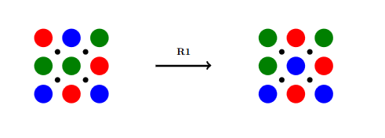
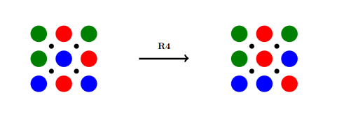

# 2d-rubiks-cube-gods-number

<b>Introduction</b>
The Rubik's cube is an extensively studied game -- lesser known, however, are its two dimensional counterparts. In this project, we investigate the combinatorics of, and compute the God's Number to a Rubik's like game in its 3x3 variant, and provide a partial solution to the 4x4 variant.

<b>How to play</b>
Starting from an initial scrambled position, the goal is move each rotation point clockwise until the board is in its solved state of 3 reds in row 1, 3 greens in row 2 and 3 blues in row 3. 

Solved state:

<b>Combinatorics</b>
In the 3x3 variant, there are three possible colors to pick from, and three of each color. Therefore, the number of possible positions in the 3x3 variant equals:
$$\binom{9}{3} \binom{6}{3} \binom{3}{3} = 1680$$
Which we confirm with Monte Carlo simulation.

The number of unique positions in the 4x4 variant follows similarly:
$$\binom{16}{4} \binom{12}{4} \binom{8}{4} \binom{4}{4} = 63063000$$

(The number of games in each variant follows the sequence A034841 in the OEIS.) We note that the number of unique positions in the 6x6 variant exceeds the number of unique positions in the traditional Rubik's cube, despite having the same number of colors.

<b>Methodology and results</b>
Using Dijkstra's algorithm on the state space graph of our game, we compute god's number in the 3x3 variant to be 9. We did not have enough memory to solve the 4x4 variant, and instead provide a candidate program to enumerate all the positions (upon from which God's number may be calculated.)

